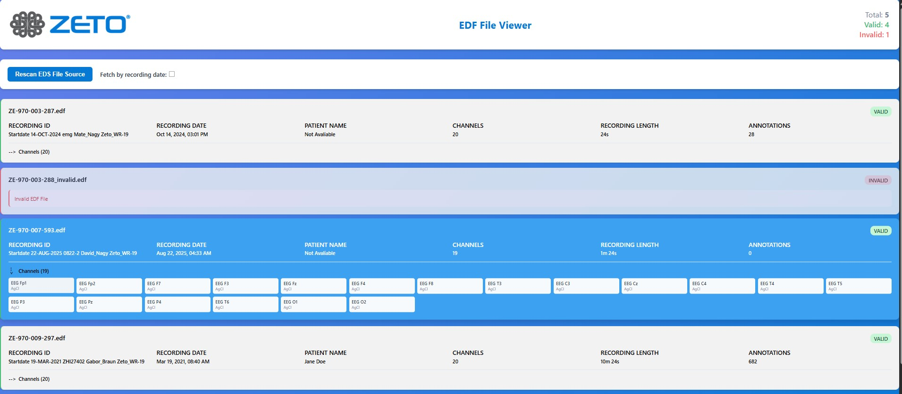

# EDF File Processor Application

A full-stack web application for processing and visualizing EDF (European Data Format) files. The application consists of a Spring Boot backend API and a Vue.js 3 frontend, providing a modern interface for browsing and analyzing EDF medical recordings.

## 🎥 Click for a short demo video

[](./edf-frontend/public/demonstration.gif)
## ☁️ Playground on Amazon Cloud
[]()
[]()
[]()

🔗 **URL:** http://zeto-frontend.s3-website.eu-north-1.amazonaws.com

- **Backend:** AWS Elastic Beanstalk
- **Frontend:** Amazon S3 (Static Website Hosting)


## 📋 Table of Contents

<!-- TOC -->
* [EDF File Processor Application](#edf-file-processor-application)
  * [🎥 Demo](#-demo)
  * [🎥 AWS Playground](#-Playground-on-Amazon-Cloud)
  * [📋 Table of Contents](#-table-of-contents)
  * [🎯 Overview](#-overview)
  * [✨ Features](#-features)
  * [🛠️ Technology Stack](#-technology-stack)
  * [📁 Project Structure](#-project-structure)
  * [🚀 Quick Start](#-quick-start)
  * [💡 Usage](#-usage)
  * [🏛️ Architecture](#-architecture)
  * [📡 API Reference](#-api-reference)
  * [🐛 Troubleshooting](#-troubleshooting)
  * [📦 Production Build](#-production-build)
  * [📄 License](#-license)
 <!-- TOC -->

## 🎯 Overview

This application demonstrates a complete solution for processing EDF medical data files with:
- **Backend**: RESTful API built with Spring Boot
- **Frontend**: Reactive UI built with Vue.js 3 and Vite
- **Data Processing**: In-memory parsing and caching of EDF files
- **Visualization**: Clean, animated interface with sorting

## ✨ Features

### Backend Features
- 📂 Automatic directory scanning for EDF files on startup
- 🔍 Robust parsing of valid and invalid EDF files
- 📊 Complete metadata extraction (channels, recordings, annotations)
- 🔄 Real-time directory rescanning
- 🛡️ RFC 7807 Problem Details error handling
- 🏗️ Domain-Driven Design architecture
- 🛡️ Thread-safety in-memory cache as EDF Storage

### Frontend Features
- 🎨 Modern, responsive Material Design-inspired UI
- ✨ Smooth animations using Animate.css
- 🔢 Real-time file statistics (total, valid, invalid)
- 🔄 Manual directory rescan capability
- 📅 Sort files by recording date
- 📋 Expandable channel details for each file
- ⚡ Fast, reactive user experience
- 🎯 Clear error messaging

## 🛠️ Technology Stack

### Backend
- **Java 17+**
- **Spring Boot 3.x** (Web, Validation)
- **Lombok** - Boilerplate reduction
- **MapStruct** - Type-safe mapping
- **EDF4J** - EDF file parsing
- **Maven** - Build tool

### Frontend
- **Vue 3** (Composition API)
- **Vite** - Build tool and dev server
- **Animate.css** - Animation library
- **JavaScript ES6+**
- **CSS3** (Scoped styles)

## 📁 Project Structure

```
Assignment_Zeto/
├── edf-processor/                    # Backend (Spring Boot)
│   ├── src/main/java/
│   │   └── com/zeto/edf_processor/
│   │       ├── config/               # Configuration
│   │       ├── controller/           # REST controllers
│   │       ├── dto/                  # Data Transfer Objects
│   │       ├── exceptions/           # Custom exceptions
│   │       ├── model/                # Domain model (DDD)
│   │       ├── repository/           # Data access layer
│   │       └── service/              # Business logic
│   ├── src/main/resources/
│   │   └── application.properties    # Backend config
│   ├── pom.xml
│   └── README.md                     # Backend documentation
│
├── edf-frontend/                     # Frontend (Vue 3 + Vite)
│   ├── src/
│   │   ├── components/               # Vue components
│   │   ├── App.vue                   # Root component
│   │   ├── main.js                   # Entry point
│   │   └── style.css                 # Global styles
│   ├── public/
│   │   └── ekg.png                   # Channel icon
│   ├── package.json
│   ├── vite.config.js
│   └── index.html
│   └── README.md                     # Frontend documentation
│
├── data/
│   └── edf/                          # EDF files directory
│       └── *.edf                     # EDF files 
│
└── README.md                         # This file
```

## 🚀 Quick Start

### Prerequisites
- Java 17+
- Node.js 18+
- npm or yarn
- EDF files in `data/edf/` directory, can be configured on the backend

### Run Everything at Once

```bash
# 1. Start Backend (Terminal 1)
cd edf-processor
mvn spring-boot:run
# Backend will start at http://localhost:8080

** Verify backend is running: **
curl http://localhost:8080/api/edfs
```

```bash
# 2. Start Frontend (Terminal 2)
cd edf-frontend
npm install
npm run dev
# Frontend will start at http://localhost:5173
```

```bash
# 3. Open Browser
# Navigate to: http://localhost:5173
```

### Data Directory Setup, if not exist

```bash
# Create data directory if it doesn't exist
mkdir -p data/edf

# Copy your EDF files
cp /path/to/your/*.edf data/edf/

# Verify files are present
```

## 💡 Usage

### Web Interface

1. **Open the application** at `http://localhost:5173`

2. **View EDF Files**
    - Files load automatically on startup
    - See total, valid, and invalid file counts
    - Each card shows file metadata

3. **Sort Files**
    - Check "Sort by recording date" to sort by recording date
    - Unchecked shows files in original order

4. **View Channels**
    - Click on the EKG icon next to "Channels" to expand
    - See all signal channels with names and types

5. **Rescan Directory**
    - Click "Rescan EDS File Source" to reload files
    - Useful after adding/removing files

### API Usage

**Get all files:**
```bash
curl http://localhost:8080/api/edfs
```

**Get sorted files:**
```bash
curl http://localhost:8080/api/edfs/sorted
```

**Rescan directory:**
```bash
curl -X POST http://localhost:8080/api/edfs/rescan?sorted=true
curl -X POST http://localhost:8080/api/edfs/rescan?sorted=false
```

## 🏛️ Architecture

### System Overview

```
┌─────────────────┐
│   Web Browser   │
└────────┬────────┘
         │ HTTP
         │
┌────────▼────────┐      ┌──────────────┐
│  Vue Frontend   │◄────►│  Spring Boot │
│  (Port 5173)    │ REST │  (Port 8080) │
└─────────────────┘      └──────┬───────┘
                                │
                         ┌──────▼───────┐
                         │  File System │
                         │  (data/edf/) │
                         └──────────────┘
```

## 📡 API Reference

### Base URL
```
http://localhost:8080/api/edfs
```

### Endpoints

| Method | Endpoint | Description | Response |
|--------|----------|-------------|----------|
| GET | `/api/edfs` | Get all EDF files | Array of EdfDto |
| GET | `/api/edfs/sorted` | Get sorted files | Array of EdfDto (sorted) |
| POST | `/api/edfs/rescan?sorted=true/false` | Rescan directory | Array of EdfDto |

### Adding New EDF Files

```bash
# Copy files to data directory
cp /path/to/new/*.edf data/edf/

# Rescan via API
curl -X POST http://localhost:8080/api/edfs/rescan

# Or click "Rescan EDF File Source" in the UI
```

## 🐛 Troubleshooting

### Backend Issues

**Problem: Backend won't start**
```bash
# Check if port 8080 is in use
lsof -i :8080

# Kill process or change port in application.properties
server.port=8081
```

**Problem: Files not loading**
```bash
# Check file permissions
ls -la data/edf/

# Verify files have .edf extension
ls data/edf/*.edf
```

### Frontend Issues

**Problem: Frontend won't start**
```bash
# Clear node_modules and reinstall
rm -rf node_modules package-lock.json
npm install
npm run dev
```

**Problem: API not reachable**
```javascript
// Check API_BASE_URL in src/App.vue
const API_BASE_URL = 'http://localhost:8080/api/edfs'

// Verify backend is running
curl http://localhost:8080/api/edfs
```


**Problem: Invalid file errors**
```
Cause: Corrupted or non-EDF files
Solution: Files marked as invalid will still appear with error message
Check file integrity with EDF validation tool
```

## 📦 Production Build

### Backend

```bash
cd edf-processor
# Run tests
mvn test
mvn clean package
java -jar target/edf-processor-0.0.1-SNAPSHOT.jar
```

### Frontend

```bash
cd frontend
npm run build
# Preview production build
npm run preview
# Lint code
npm run lint
# Files will be in dist/ directory
# Deploy to any static file server
```

## 📄 License

This project is part of the EDF Processing Assignment for the Senior Full-Stack Developer position for Zeto Inc.
It is for demonstration and evaluation purposes only.

#### 👨‍💻 Author: Peter Kormos
#### 📅 Date: November 2025

